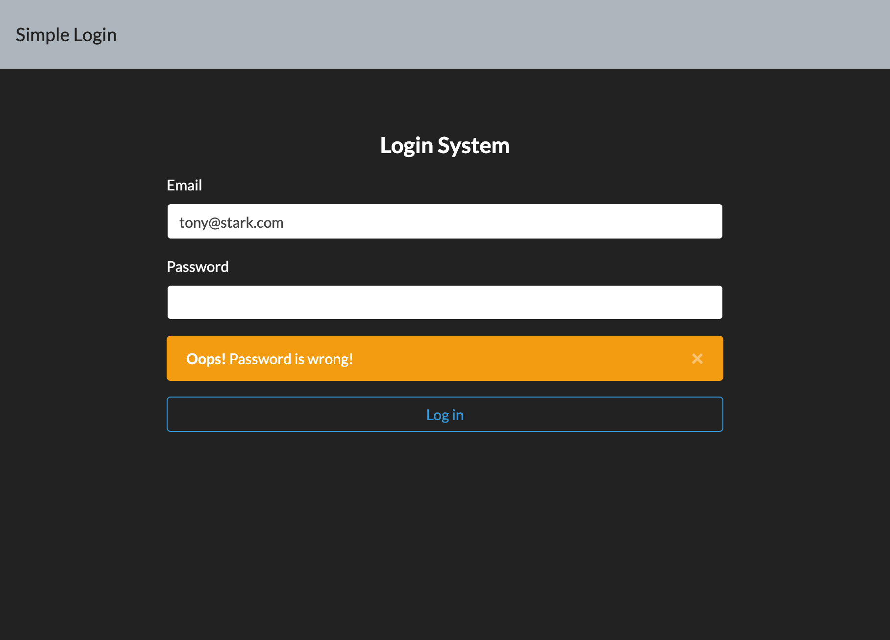
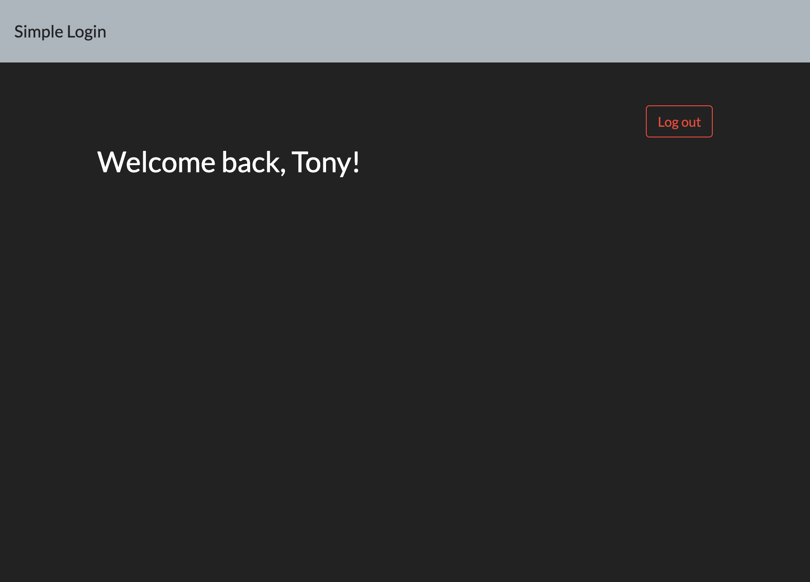

<!-- ABOUT THE PROJECT 2-3 A10 A11: 帳密檢查機制 -->
## :page_facing_up: Log in 帳密檢查機制與保存使用者登入狀態

### :heavy_check_mark: Features

- User can use user's email and password to log in.
- User can test user login by user list in "userSeeder.js" file.
- Keep login by Cookie-based Authentication

### :computer: UI Screenshot






<!-- GETTING STARTED -->
## :bulb: Getting Started

#### Clone repository
```
$ git clone https://github.com/BoboLin945/account-login.git
```
#### Install by npm
```
$ npm install
```
#### DB Seed
```
$ npm run seed
```
#### Execute
```
$ npm run dev
```
#### Browse the website on localhost
```
http://localhost:3000/
```


### 🔧  Built With

* [Node.js](https://nodejs.org/en/) (^10.15.0)
* [Express](https://expressjs.com/)   (^4.17.1)
* [Express-Handlebars](https://www.npmjs.com/package/express-handlebars) (^5.3.2)
* [Bootstrap](https://getbootstrap.com) (^4.3.1)
* [mongoose](https://mongoosejs.com/) (^5.12.11)
* [express-session] (^1.17.2)
* [connect-flash] (^0.1.1)
* [cookie-parser] (^1.4.5)